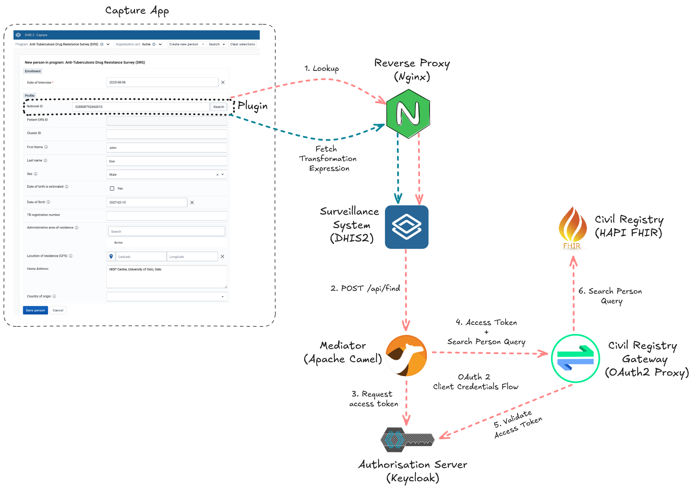
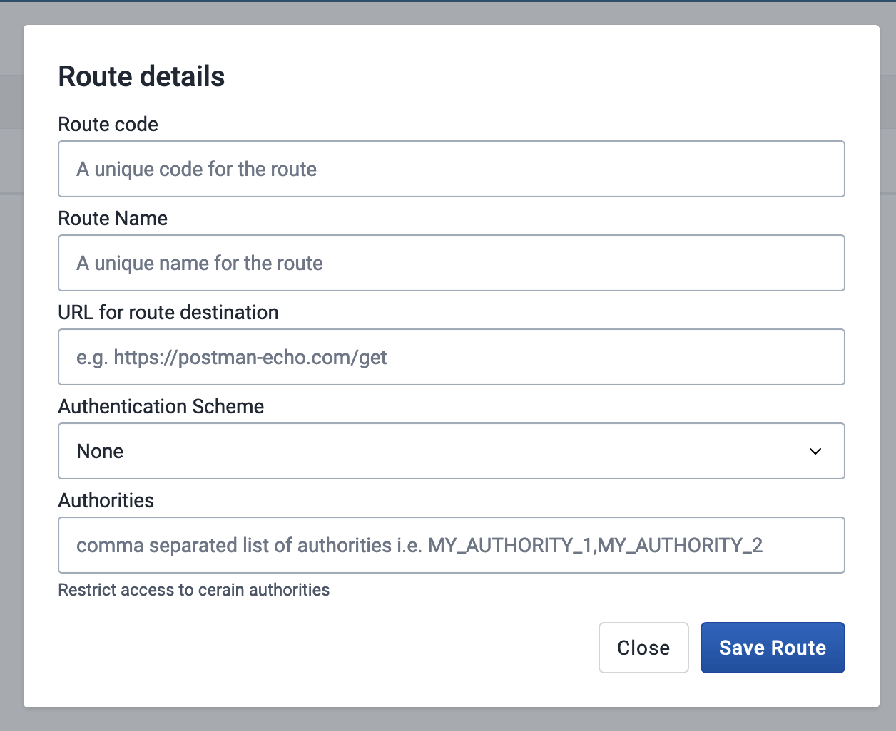
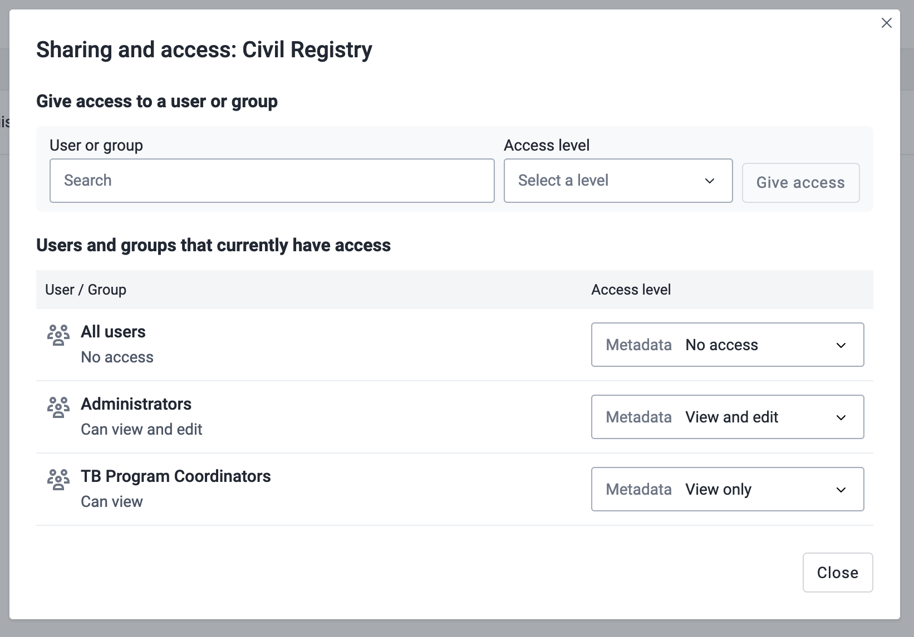

# Civil Registry Lookup - reference implementation

1. [What is this implementation?](#what-is-this-implementation)
2. [Quick Start](#quick-start)
3. [Overview](#overview)
    1. [DHIS2 Capture App Plugin](#dhis2-capture-app-plugin)
    2. [Reverse Proxy](#reverse-proxy)
    3. [Surveillance System](#surveillance-system)
    4. [Mediator](#mediator)
    5. [Authorisation Server](#authorisation-server)
    6. [Civil Registry Gateway](#civil-registry-gateway)
    7. [Civil Registry](#civil-registry)
4. [Security Considerations](#security-considerations)
5. [Support](#support)

## What is this implementation?

A civil registry is a national database for storing personal details of citizens. It is useful to look up information from the civil registry to automatically populate forms in DHIS2. Automatic population reduces the chances of errors and provides a quick way to prefill forms with patient information that is accurate and up-to-date.

This reference implementation illustrates a [DHIS2 Capture app plugin](https://developers.dhis2.org/docs/capture-plugins/developer/getting-started) that looks up and transforms data from a civil registry before prefilling fields with demographic information in a form used to carry out an [Anti-Tuberculosis Drug Resistance Survey (DRS)](https://docs.dhis2.org/en/implement/health/tuberculosis/anti-tuberculosis-drug-resistance-survey-drs/design.html). 

The plugin accesses the civil registry through a [route](https://docs.dhis2.org/en/develop/using-the-api/dhis-core-version-master/route.html) configured in DHIS2. This DHIS2 route proxies lookup requests to a mediator restricting access to the civil registry. On receiving the route request, the mediator queries the civil registry for the person where the results are returned to the DHIS2 route client, that is, the Capture app plugin. The information originating from the civil registry could potentially contain the national ID, first name, last name, gender, date of birth, and so on.

This is an example meant to guide you in developing your own civil registry lookup solution. It **SHOULD NOT** be used directly in production without adapting it to your local context.

## Quick Start

You can use the included [Docker Compose config](docker-compose.yml) to run this self-contained example in a non-production environment. This config stands up the DHIS2 and civil registry containers together with ancillary containers for authentication, transformation, and proxying. Besides standing up and wiring the containers, the config also (1) creates the DHIS2 metadata of a simple Tracker programme, (2) configures a DHIS2 route, and (3) registers the clients in [KeyCloak](https://www.keycloak.org/) for authenticating and validating requests to the civil registry.

The following prerequisites need to be installed prior to running the config with Docker Compose:

* [Docker Desktop](https://docs.docker.com/desktop/)
* [Maven](https://maven.apache.org/install.html)
* [Node.js](https://nodejs.org/en/download)
* [Yarn](https://classic.yarnpkg.com/lang/en/docs/install)

Once the prerequisites are installed and the Git repository has been cloned to the local machine, run the subsequent terminal commands to build the components, start all services with [Docker Compose](https://docs.docker.com/compose/), and seed the system with example metadata and data:

```sh
yarn install --frozen-lockfile
yarn build
yarn start
```

Execute the following command in a different terminal if you want to run the API tests:

```sh
yarn test
```

Walkthrough the steps below to obtain an end-to-end experience of the civil registry lookup:

1. Open http://localhost:8080 from your browser to bring up the DHIS2 login page.
2. Log into DHIS2 using the username `admin` and password `district`. 
3. When logged in, open http://localhost:8080/apps/capture#/new?orgUnitId=sZ79N6vfrSR&programId=KYzHf1Ta6C4 to load the Anti-Tuberculosis DRS DHIS2 Capture programme. 
4. From the `Profile` section of the form, type the person identifier `328808792660011` inside the `National ID` text field and then click on the `Search` button next to the field. 
5. After a moment or two, the `First Name`, `Last name`, `Sex`, `Date of Birth`, and `Home Address` form fields are populated with information about the searched person.

## Overview

The purpose of the civil registry lookup workflow is to reduce the chances of errors and provide a quick way to prefill forms with patient information. This implementation makes available a DHIS2 Capture plugin that a country can reference to guide the development of its own plugin, designed for the country's civil registry and DHIS2 architecture. The plugin follows best practices that match the functionality offered by DHIS2 v40.5 and later while also being designed to be secure and flexible.

The subsequent diagram conceptualises the architecture of this reference implementation:



These components can be stood up from the [Docker Compose file](https://docs.docker.com/reference/compose-file/) shipped with the reference implementation project which is found in the `docker-compose.yml` YAML config within the root directory. Nonetheless, when configuring for a real-world implementation, it is important to understand which components to incorporate directly into your production system (e.g., DHIS2 Capture App Plugin) and which to replace with existing components from your architecture (e.g., civil registry).

The civil registry lookup workflow is accomplished in a few steps:

1. The health worker types the national ID in field contained within a Capture app form and then clicks on the search button
2. The Capture app lookup plugin transmits a request for looking up a person by their national ID to a DHIS2 route
3. The DHIS2 route proxies the request to a mediator sitting in front of the civil registry.
4. The mediator obtains an access token from an authorisation server and includes this token in a query it sends to the civil registry
5. A gateway intercepts the query and validates the token before forwarding the authorised query to the civil registry
6. If found, the civil registry responds with the person details.
7. The response is returned to the origin, that is, the plugin.
8. The plugin uses a mapping file, downloaded from DHIS2's data store, to transform the fetched person details into a structure it can read.
9. The plugin goes on to read the transformation output and populate the Capture form 

What follows is a brief overview of the architectural components:

### DHIS2 Capture App Plugin

The Capture app plugin is a [DHIS2 web app](https://developers.dhis2.org/docs/quickstart/quickstart-web/) with a Capture plugin entrypoint. The source code is located in the `civil-registry-plugin` directory of the reference implementation project. The plugin renders a text field together with a search button for looking up a person by their national ID. When the plugin is loaded, it fetches the [JSONata](https://jsonata.org/) expression belonging to the `civilRegistryPlugin` namespace within the [DHIS2 data store](https://dhis2-app-course.ifi.uio.no/learn/dhis2/app-development-guides/datastore/). JSONata is a declarative open-source query and transformation language for JSON data. Shown below is the JSONata expression that is retrieved from the data store:

```jsonata
{
  "id": entry[0].resource.identifier[0].value,
  "firstName": entry[0].resource.name[0].given[0],
  "lastName": entry[0].resource.name[0].family,
  "sex": $uppercase(entry[0].resource.gender),
  "dateOfBirth": entry[0].resource.birthDate,
  "address": $join(entry[0].resource.address[0].line, ", "),
  "phone": entry[0].resource.telecom[0].value
}
```

 On clicking the search button, the lookup plugin POSTs a request containing the national ID to a DHIS2 route identified by the code `civil-registry`. It then feeds the FHIR JSON response body returned from the route along with the above JSONata expression to the [JSONata engine](https://www.npmjs.com/package/jsonata) in order to transform the FHIR body into an internal structure that the plugin can process. Here is a sample of a response that the plugin receives from the civil registry route:

```json
{
  "resourceType":"Bundle",
  "id":"88c31daa-e04b-424d-9df2-dbfada610105",
  "meta":{
    "lastUpdated":"2025-08-07T10:46:46.626+00:00"
  },
  "type":"searchset",
  "total":1,
  "link":[
    {
      "relation":"self",
      "url":"http://civil-registry-gateway:4180/fhir/Person/_search"
    }
  ],
  "entry":[
    {
      "fullUrl":"http://civil-registry-gateway:4180/fhir/Person/1",
      "resource":{
        "resourceType":"Person",
        "id":"1",
        "meta":{
          "versionId":"1",
          "lastUpdated":"2025-08-07T10:46:06.100+00:00",
          "source":"#BanCKiOVbFfMEMSZ"
        },
        "identifier":[
          {
            "value":"328808792660010"
          }
        ],
        "name":[
          {
            "family":"Doe",
            "given":[
              "John"
            ]
          }
        ],
        "telecom":[
          {
            "value":"+998 12345678"
          }
        ],
        "gender":"male",
        "birthDate":"2007-02-15",
        "address":[
          {
            "line":[
              "HISP Centre",
              "University of Oslo",
              "Oslo"
            ]
          }
        ]
      },
      "search":{
        "mode":"match"
      }
    }
  ]
}
```

Given the JSONata expression fetched from the data store and the above response body example, the engine would produce the following:

```json
{
  "id": "328808792660010",
  "firstName": "John",
  "lastName": "Doe",
  "sex": "MALE",
  "dateOfBirth": "2007-02-15",
  "address": "HISP Centre, University of Oslo, Oslo",
  "phone": "+998 12345678"
}
```

 Having the transformation expression defined in the data store means that the plugin is decoupled from the FHIR JSON structure of the civil registry response. That is, the plugin source code does not need to be modified, rebuilt, and reinstalled whenever the field content is adjusted or the JSON structure of the civil registry response changes. Instead, from the data store app, the DHIS2 user managing the programme would edit the JSONata expression within the `personMap` key residing in the `civilRegistryPlugin` namespace such that it transforms the response body into the desired output.

### Reverse Proxy

As in many real-world DHIS2 installations, [Nginx](https://nginx.org/) sits in front of DHIS2 to provide reverse proxy capabilities. For this reference implementation, the reverse proxy is primarily configured to set a few request headers and forward requests to the DHIS2 web server. However, in practice, the reverse proxy would also be configured to cache content, rewrite URLs, balance the load, and so on.  

### Surveillance System

The minimum version of your DHIS2 instance should be at least [v40.5](https://dhis2.org/downloads/) when seeking to adapt the reference implementation. DHIS2 is customised in this set up to present survey questions and collect the answers. DHIS2 can then aggregate these answers for reporting and visualisation purposes. 

Besides being a surveillance system, DHIS2 acts as a proxy where it routes lookup requests from the Capture app plugin to the upstream mediator. The DHIS2 route can be viewed and edited from the Route Manager app which is available on [App Hub](https://apps.dhis2.org/app/5dbe9ab8-46bd-411e-b22f-905f08a81d78). Go to the [Route Manager Configuration](#route-manager-configuration) section of this documentation to learn more about Route Manager. The plugin bundled with this reference implementation expects a route with the code `civil-registry` to be configured. This route is a conduit for the plugin to transmit its requests to the civil registry.

The data store in this DHIS2 instance defines the subsequent keys driving the behaviour of the Capture app:

1. A `dataEntryForms` key residing in the `capture` namespace that holds a JSON config. This config defines which app plugins are added to the survey form and the fields that the plugin/s have access to. The config for this implementation can be viewed in the [`pluginConfig.json`](config/dhis2/pluginConfig.json) file within the `config/dhis2` directory of this project. The [DHIS2 developer website explains](https://developers.dhis2.org/docs/capture-plugins/developer/form-field-plugins/manual-setup/) the `dataEntryForms` config in detail, however, the Capture app administrator should avoid directly editing this config. Instead, they should leverage the convenience app [Tracker Plugin Configurator](https://apps.dhis2.org/app/85d156b7-6e3f-43f0-be57-395449393f7d) as recommended in the [Capture plugins documentation](https://developers.dhis2.org/docs/capture-plugins/developer/configure-a-capture-plugin).

2. A `personMap` key residing in the `civilRegistryPlugin` namespace that holds an escaped [JSONata](https://jsonata.org/) transformation expression. As explained in the [DHIS2 Capture App Plugin](#dhis2-capture-app-plugin) section, the `personMap` key drives the transformation of the civil registry response to the response the plugin expects, allowing the plugin to be decoupled from the [FHIR JSON bundle resource](https://build.fhir.org/bundle.html). The Capture app administrator is expected to edit the transformation expression through the [Datastore app](https://apps.dhis2.org/app/c968eb49-01f5-4904-b4d3-f3785c6bfc09). The expression for this implementation can be viewed in the [`personMap.json`](config/dhis2/personMap.json) file within the `config/dhis2` directory of this project.

### Mediator

The mediator is a low-code [OpenAPI-driven](https://www.openapis.org/) solution implemented with [Apache Camel](https://camel.apache.org/). The [DHIS2 developer documentation](https://developers.dhis2.org/docs/integration/apache-camel) provides a gentle introduction to Apache Camel. The source code for the mediator is located inside the `mediator` directory of the reference implementation project.

The role of the mediator is to hide the details of OAuth 2 authentication and civil registry querying from the DHIS2 route. On receiving an HTTP POST request with the national ID, the mediator uses its configured client ID and client secret to request an access token from the [authorisation server](#authorisation-server). The client ID and secret parameters are configured in the `application.yaml` project file which is found in the `mediator/src/main/resources` directory. Here is a YAML snippet demonstrating configuration of these parameters:

```yaml
oauth2:
  clientId: civil-registry-client
  clientSecret: passw0rd
  tokenEndpoint: http://authorisation-server/realms/civil-registry/protocol/openid-connect/token
```

After receiving the access token, the mediator adds it as an HTTP header to its search person query and then transmits the query to the civil registry. The mediator returns the civil registry results to the DHIS2 server if the results contains a person. If the civil registry query does not return a person, then the mediator returns an HTTP `404 Not Found` error to DHIS2.

### Authorisation Server

The [civil registry](#civil-registry) is protected from unauthorised access with OAuth 2.0 client credentials (i.e., machine-to-machine) authorisation. In particular, [Keycloak](https://www.keycloak.org/) is acting as an authorisation server that issues short-lived access tokens to authorised clients in order to grant access to the civil registry. The [mediator](#mediator) is an authorised client because it is configured with a client ID and secret that allows it to obtain an access token from Keycloak. The mediator includes the issued access token in HTTP requests transmitted to the civil registry gateway. The gateway validates the access token with the same Keycloak instance. If the validation is successful, the gateway forwards the request to the civil registry.

### Civil Registry Gateway

The reverse proxy powering the gateway is [OAuth2 Proxy](https://oauth2-proxy.github.io/oauth2-proxy/). The gateway secures the unprotected HAPI FHIR server, that is, the civil registry from unauthorised access. The gateway intercepts each request to the civil registry and validates the request access token with the [authorisation server](#authorisation-server). On successful validation, the gateway forwards the request to the civil registry. On failure, the gateway responds to the client, that is the mediator, with an HTTP `401 Unauthorized` error. 

The OAuth2 Proxy config employed for this set up is located in `config/civil-registry-gateway/oauth2-proxy-keycloak.cfg` within the reference implementation project.

### Civil Registry

A [HAPI FHIR](https://hapifhir.io/) server mocks the civil registry. Individuals are represented in the FHIR server using the [FHIR Person resource](https://www.hl7.org/fhir/person.html). As part of the example set up, the server is seeded with a few Person resources which are read from the path `config/civil-registry/persons.json`, located in the reference implementation project. 

Adapting this reference implementation usually means modifying the mediator to support the existing civil registry in your architecture.

## Security Considerations

* Civil registry access control varies widely across implementations and it is outside the scope of this reference implementation. The way the civil registry is secured in this reference implementation is for illustration purposes only.

* Only highly privileged DHIS2 users such as administrators should be able to configure routes and access Route Manager. However, all users with access to the Anti-Tuberculosis DRS Capture programme should be able to run the DHIS2 route. It is imperative that the DHIS2 authorities are assigned according to the aforementioned permissions to prevent unauthorised access to the civil registry. Rights to creating or editing routes should be given with extreme caution. If inappropriately configured, a DHIS2 route can compromise the security of the system.

* The route runs for the `civil-registry` DHIS2 route should be audited in order to have a trail of the DHIS2 users looking up persons from the civil registry. Route runs are automatically audited in the latest releases of DHIS2 unless explicitly disabled by the DHIS2 server administrator.

* All parties, including the Capture app programme user, are assumed to be trusted from the civil registry's perspective in this reference implementation. If a party in this workflow is untrusted, then rate limiting should be considered in order to reduce the risk of abuse.

* Sensitive data, like the national ID, should always be carried in the body of HTTP POST requests. Transmitting sensitive data in the body of POST requests, as opposed to including it in the URL query params, reduces the risk of personal identifiable information leaking into the server access logs.

* The reference implementation, by its nature, facilitates the searching and transferring of data which most likely contains personal identifying information. For this reason, a Privacy Impact Assessment (PIA) ought to be carried out before granting civil registry lookup access to DHIS2. In some jurisdictions (e.g., European Union), a PIA is required in order to comply with national regulations.

## Route Manager Configuration

You will need to add a new route to DHIS2 to configure the route for the civil registry lookup. This route is used by the Capture app plugin to look up information from the civil registry. For this reference implementation, the code `civil-registry` identifies the lookup route. The [Route Manager App](https://apps.dhis2.org/app/5dbe9ab8-46bd-411e-b22f-905f08a81d78) is used to configure the route.

### Configuration Steps

#### Install Route Manager from App Hub

Route Manager is available from [App Hub](https://apps.dhis2.org/app/5dbe9ab8-46bd-411e-b22f-905f08a81d78). You can (a) download the app from the App Hub and upload it to your DHIS2 instance, or even better, (b) install it directly in your DHIS2 instance in the App Management App.

1. Go to the App Management app in your DHIS2 instance
2. Click on the `App Hub` tab
3. Search for `Route Manager`
4. Click on the `Install` button

#### Configure the route

1. Open the Route Manager app from DHIS2.
2. Click on the `Create new Route` button on the top right of the screen. A form to fill out the route details is presented:

   

3. Fill out the form with the following details:
   
   | Field                 | Value                   | Comments                                                                       |
   |-----------------------|-------------------------|--------------------------------------------------------------------------------|
   | Route Code            | `civil-registry`        | The plugin expects this exact value                                            |
   | Name                  | `Civil Registry Lookup` | This name is up to you to decide                                               |
   | URL                   | `http://localhost:8080` | The URL configured by the middleware                                           |
   | Authentication Scheme | `API Token`             | The middleware requires authorisation so this should be set to `API Token`     |
   | Token                 | `$ecr3t`                | The middleware handles Authentication so this should be left to `None`         |
   | Authorities           | `PLUGIN_USERS`          | Use the authority that represents the users that will interact with the plugin |

4. Click on the `Save Route` button.

#### Restrict access

Access to the configured route can be restricted after saving it which will prevent unauthorized users from editing the route. To configure sharing, click the `Sharing` button in Route Manager on the `civil-registry` route.



You can observe a sharing configuration in the above screenshot. The configuration gives access to the `Administrators` user group to view and edit the route while the `TB Program Coordinator` user group to view the route. The `All users` user group is denied any access to the route. Needless to say that the configuration should be adapted to your implementation accordingly.

#### Test Route

The `Test` button in Route Manager permits you to try out the route once it is saved. Clicking the button will send a request to the URL configured in the route and show the response in Route Manager directly. If it is successful, you should see a response from the civil registry.

# Support

Questions or feedback about this reference implementation can be posted on the [DHIS2 Community of Practice](https://community.dhis2.org/). Contributions in the form of [pull requests](https://github.com/dhis2/reference-civil-registry-lookup/pulls) are more than welcome.
