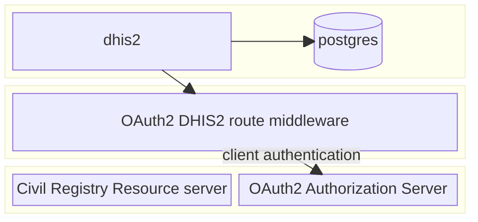

# Civil Registry Lookup - reference implementation

This is a reference implementation of a **civil registry lookup** from within the DHIS2 Capture App, with a FHIR-compliant civil registry backend protected by OAuth2 authorization.  This is an example which should be used for reference, it **SHOULD NOT** be used directly in production.

## Components

* DHIS2 v41
* Mock Civil Registry (FHIR-compliant)
* OAuth2 Route Middleware
* OAuth2 Authentication server (Keycloak)
* Civil Registry lookup plugin (DHIS2 Capture App plugin)

## Architecture

## Running the example

To run this self-contained example setup (in non-production environments), you can use the included `docker-compose` configuration.

Running the following command will spin up all components listed above, install the civil registry lookup plugin in DHIS2, configure DHIS2 metadata with a simple Tracker program, and set up the necessary clients in KeyCloak for both DHIS2 authentication and civil registry resource protection (through a DHIS2 route).

## Configuring for Production

When configuring for production, it is important to understand which components to incorporate directly into your production system and which to replace with existing components from your infrastructure.

The following components can be added to your production architecture 